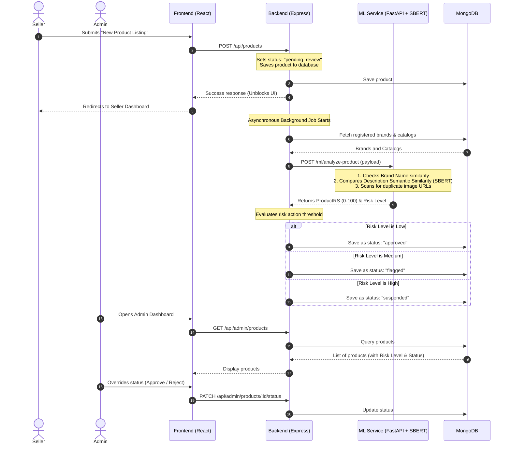

# AI Integration Summary: Listing Cloning & Fake Product Detection

This document summarizes the AI-powered trust & safety pipeline implemented to detect "Listing Cloning" and fake product listings on the marketplace.

---

## 1. System Architecture

The solution uses a hybrid architecture combining a high-performance **Node.js/Express** backend and a dedicated **Python FastAPI ML Server** running a lightweight Sentence-Transformer model.



---

## 2. Key Components Implemented

### A. Python FastAPI ML Server
* **Location:** [ml/main.py](file:///c:/Dev/AI%20Powered%20Marketpllace%20Security/ml/main.py)
* **Model:** `sentence-transformers/all-MiniLM-L6-v2` (cached locally in memory).
* **Endpoints:**
  * `GET /health`: Standard service health status.
  * `POST /ml/analyze-product`: Executes text analysis.
* **Scoring Heuristics:**
  * **Brand Alignment (difflib/Jaro-Winkler ratio):** Checks if the claimed brand matches registered brands or protected keywords (Threshold > 0.8).
  * **Semantic Closeness (SBERT Cosine Similarity):** Encodes descriptions and measures cosine similarity against official catalog entry descriptions.
  * **Image Reuse:** Verifies whether input image URLs match official assets in the catalog.

### B. Backend Node.js Service Integration
* **Location:** [backend/src/services/aiPipeline.service.js](file:///c:/Dev/AI%20Powered%20Marketpllace%20Security/backend/src/services/aiPipeline.service.js)
* **Description:** Asynchronously queries registered brands and catalogs from MongoDB, formats the payload, invokes the ML service, maps risk scores to lifecycle states, and updates MongoDB.

### C. Patched Product Service Hook
* **Location:** [backend/src/modules/products/product.service.js](file:///c:/Dev/AI%20Powered%20Marketpllace%20Security/backend/src/modules/products/product.service.js)
* **Description:** Intercepts `createProduct` to default new listings to `pending_review` and schedules the AI background task asynchronously.

### D. Integration Verification Script
* **Location:** [backend/test_product.js](file:///c:/Dev/AI%20Powered%20Marketpllace%20Security/backend/test_product.js)
* **Description:** Simulates database connections, creates mock data, registers product, executes the AI analysis pipeline, and checks status changes.

---

## 3. Moderation Rules & Lifecycle

Based on the computed **Product Risk Score (ProductRS)** out of 100, the listing status is set automatically:

| Risk Score | Risk Level | Action taken | Status |
| :--- | :--- | :--- | :--- |
| **< 40** | Low | Approved automatically | `approved` |
| **40 - 69** | Medium | Flagged for manual brand review | `flagged` |
| **>= 70** | High | Immediately suspended from public search | `suspended` |

---

## 4. How to Test and Run the System

### Start the ML Server
Ensure the Python environment is activated and start Uvicorn:
```powershell
cd ml
venv\Scripts\activate
uvicorn main:app --port 8000
```

### Run Integration Test
Run the test script from the backend directory:
```powershell
cd backend
node test_product.js
```

### Direct API Endpoint Test
Send a sample listing to the ML analyzer:
```bash
curl -X POST "http://127.0.0.1:8000/ml/analyze-product" \
     -H "Content-Type: application/json" \
     -d '{
       "productId": "test_id",
       "title": "Cheap N1ke Shoes",
       "description": "Replica Nike Air Max sneakers on discount",
       "brandName": "N1ke",
       "category": "Footwear",
       "brands": [
         {
           "id": "brand_nike",
           "name": "Nike",
           "protectedKeywords": ["nike", "air max"],
           "catalogEntries": [
             {
               "id": "nike_air_max",
               "title": "Nike Air Max 90",
               "description": "Original high performance athletic sneakers featuring the iconic air max sole unit.",
               "officialImages": ["http://example.com/official.jpg"]
             }
           ]
         }
       ]
     }'
```
