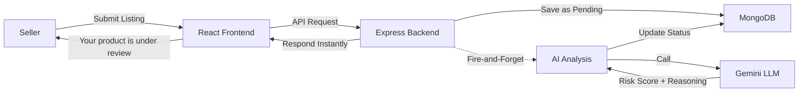
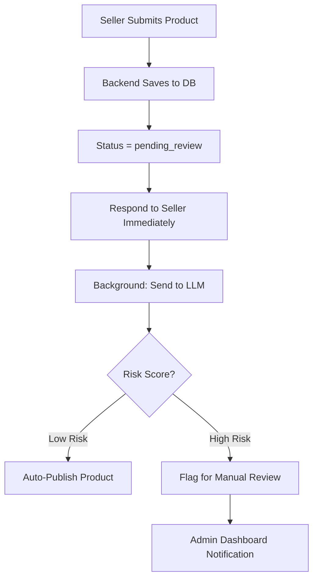
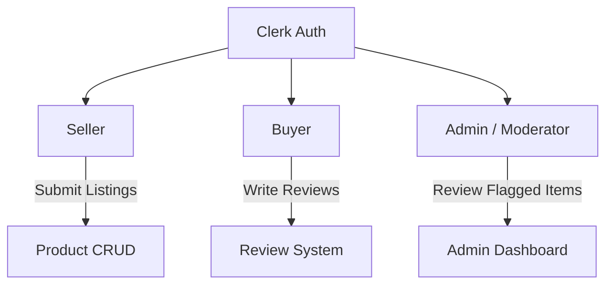
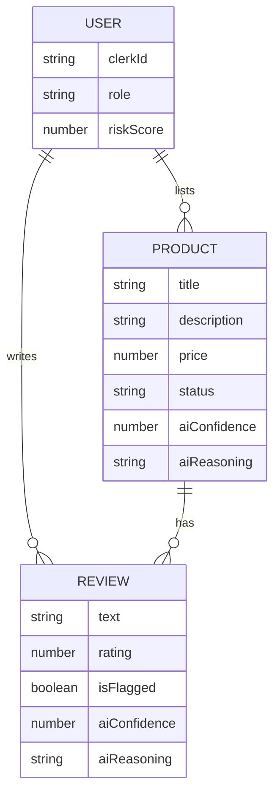

# AI-Powered Trust & Safety Platform

This is the plan overview. Treat this as a reference to understand the project structure and flow. Ofc if need be then change this overview file as well!

## Problem Statement

Build an AI-powered platform that enhances marketplace trust through:

- **Fraud Detection** — Flag fraudulent or counterfeit product listings before they go live.
- **Fake Review Detection** — Analyze review patterns to identify bot-generated or incentivized reviews.
- **Risk Scoring** — Assign a dynamic risk score to each seller based on their listing and review history.
- **Product Lifecycle Monitoring** — Track products from listing to returns for suspicious patterns.

---

## Tech Stack

| Layer     | Technology                  |
| --------- | --------------------------- |
| Frontend  | React (Vite)                |
| Backend   | Node.js + Express           |
| Database  | MongoDB (Mongoose)          |
| Auth      | Clerk                       |
| AI Engine | Google Gemini API (via LLM) |

---

## Architecture Overview

---

## Core Flow

---

## User Roles

| Role   | Capabilities                                               |
| ------ | ---------------------------------------------------------- |
| Seller | Create/edit listings, view their risk score, see status    |
| Buyer  | Browse products, write reviews                             |
| Admin  | View flagged products, approve/reject, see all risk scores |

---

## AI Detection Strategy

### THIS IS NOT THE FINAL STRATEGY! (IMPORTANT)
**REMEMBER: We WILL change the strategy during implementation! We'll use distBERT or maybe xgboost, for now we're only doing API calls to verify that our backend actually works before using any models.**
**So make sure whatever you implement is highly modular, so when we remove this code later down the road, the whole project won't suffer**

### What the LLM Analyzes

| Target           | Input Data                                          | What It Detects                                         |
| ---------------- | --------------------------------------------------- | ------------------------------------------------------- |
| Product Listings | Title, description, price, category, seller history | Unrealistic claims, mismatched info, keyword stuffing   |
| Reviews          | Review text, rating, timestamp, product context     | Generic praise, sentiment mismatch, repetitive patterns |
| Review Batches   | Last N reviews for a product grouped together       | Coordinated bot rings, burstiness, copy-paste patterns  |

### LLM Output Format

The LLM will return structured JSON for every analysis:

- **risk_score** — 0 to 100 (Risk level associated with the content)
- **reasoning** — Plain English explanation of why
- _TODO: Refine the flag & detection logic later._

### Risk Score Thresholds

| Score Range | Action                                 |
| ----------- | -------------------------------------- |
| 0 – 39      | Auto-publish the product               |
| 40 – 69     | Flag for manual review                 |
| 70 – 100    | Auto-reject + notify admin immediately |

---

## Data Model Overview
**NOTE:** This is only an overview and not the final user model! Just to show you the flow. //TODO: Figure out final models, but we'll do that DURING the implementation and not before hand!

### Key Statuses for Products

- **pending_review** — Just submitted, AI is analyzing.
- **published** — AI cleared it (low risk) or admin approved it.
- **flagged** — AI found it suspicious, waiting for admin.
- **rejected** — Admin or AI auto-rejected it (high risk).

---

## Page Map

| Page             | Route                  | Role   | Purpose                               |
| ---------------- | ---------------------- | ------ | ------------------------------------- |
| Landing          | `/`                    | Public | Marketing page                        |
| Login / Register | `/sign-in`, `/sign-up` | Public | Clerk auth                            |
| Seller Dashboard | `/seller/dashboard`    | Seller | View listings, statuses, reviews      |
| New Listing      | `/seller/new`          | Seller | Submit a product listing              |
| Buyer Browse     | `/products`            | Buyer  | Browse and search published products  |
| Product Detail   | `/products/:id`        | Buyer  | View product, write a review          |
| Admin Dashboard  | `/admin`               | Admin  | View flagged products, approve/reject |
| Dev Tools        | `/dev`                 | Dev    | Developer mode — simulation & bulk inject |

add more pages if needed this is just for reference!

---

## 🛠 Developer Mode (Simulation Toolkit)

> Hidden behind `DEV_MODE=true`. Lets us simulate fraudulent seller/buyer behaviors to stress-test the AI detection pipeline. All injected data is tagged `source: "dev_simulation"` for easy cleanup.

### Features

- **Bulk Review Import** — Upload CSV of reviews with custom product, rating, text, and timestamp per row
- **Bulk Product Import** — Same for listings — test keyword stuffing, price anomalies, category mismatches
- **Timestamp Controls** — Per-entry manual timestamps, or auto-modes: spread (over days), burst (all at once), random
- **Review Pattern Presets** — Generate fake batches without CSV: copy-paste rings, sentiment mismatches, generic praise floods, organic-looking reviews, single-buyer spam
- **Seller Behavior Sim** — Rapid-fire listing creation, price manipulation over time, category hopping, ghost sellers
- **One-Click Fraud Scenarios** — Pre-baked setups: counterfeit listing, review bombing, slow burn fraud, competitor sabotage, shill networks
- **Timeline Scrubber** — Visualize & drag-adjust event timestamps before committing to DB
- **Data Management** — Purge all dev data, snapshot/restore DB state, export AI results as CSV/JSON

*TODO: Think more about Dev Mode features, add/remove features later!*
*TODO: Design the Dev Mode UI layout and components.*
