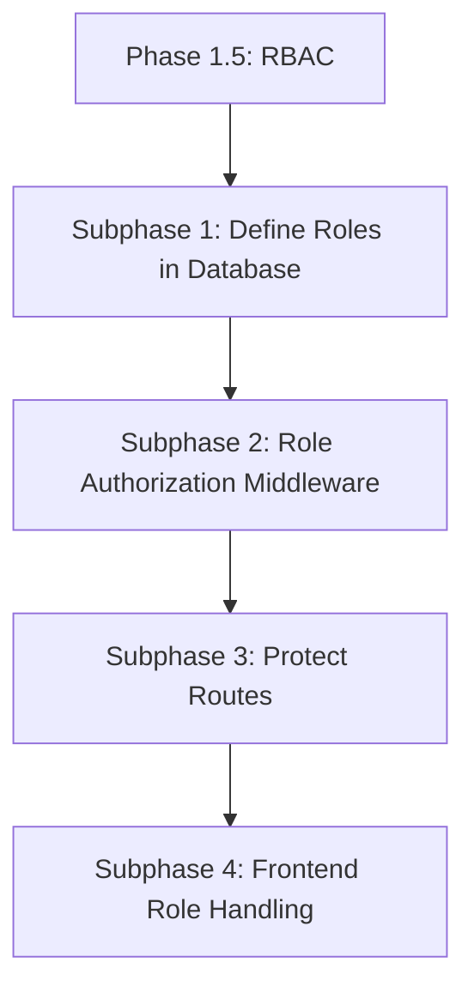

# Phase 1.5: Role-Based Access Control

**Goal:** Implement role-based access control to differentiate between sellers and admins.
We only deal with seller and admins for now!

## Subphase 1: Define Roles in Database

Ensure that the user schema and the database possess correct role definitions and data so the app can differentiate users.

- **How:** Validate that the User model specifically handles roles correctly (`admin` or `seller`). No need to modify the older ones. I'll simply delete the older documents. Make sure that the Clerk webhook is correctly assigning a default role to new users.

## Subphase 1.25: Frontend Clerk Signup Role Selection and Integration

Allow users to select their role during signup and ensure it is correctly saved in the database.

- **How:** Configure the Clerk sign-up form to include a custom field for role selection (admin or seller).

## Subphase 1.5: Clerk Webhooks for Reliable Database Registration (Missing Piece)

Ensure that every new user authenticated through the clerk form is reliably registered in our MongoDB with the correct role. In the clerk signup form, we already added a custom field for role selection (e.g. seller). The backend will listen to Clerk webhooks to create/update users in the database with the correct role.

- **How:** Use the already setup endpoint `/webhooks/clerk`. Read /backend/src/modules/weebhokes/ folder and understand the already setup stuff. Simply add to it.

- **Verification Checklist:**
  - [ ] Sign up a new user via the Clerk frontend form, selecting a role. Verify that this user is created in MongoDB with the correct role assigned.

## Subphase 2: Role Authorization Middleware

Control access to specific resources based on the user's assigned role.

- **How:** Write an Express middleware (e.g., `checkRole(['seller', 'admin'])`) that inspects the requesting user's identity/database record and either grants access or replies with a 403 error.
- **Verification Checklist:**
  - [ ] Middleware correctly extracts the role for an authenticated user.
  - [ ] Unauthenticated users are rejected before reaching role checks.

## Subphase 3: Protect Routes

Applying the role middleware to the necessary backend routes.

- **How:** Incorporate the role middleware onto routes that require heightened privileges (e.g. creating products needs 'seller').
- **Verification Checklist:**
  - [ ] Making an authorized request (e.g., accessing seller routes as a seller) succeeds.
  - [ ] Making an unauthorized request (e.g., accessing seller routes as a buyer) returns a 403 Forbidden response.

## Subphase 4: Frontend Role Handling

UI should react to the user's role, hiding and showing elements accordingly.

- **How:** Expose the user's role on the frontend context and use it to conditionally render buttons, navigation items (e.g., hiding a "Dashboard" button from regular buyers).
- **Verification Checklist:**
  - [ ] A seller sees "Dashboard" or "Create Product" buttons.
  - [ ] A buyer does not see seller-specific UI elements.

---

# Final Verification Checklist

Use this checklist to verify that all parts of Phase 1.5 and Phase 2 are thoroughly functional together:

- [ ] **Role Assignment:** Users have correct persistent roles applied upon creation.
- [ ] **Middleware Enforcement:** Protected routes enforce role-based access control correctly.
- [ ] **Frontend Role Awareness:** The frontend UI correctly reflects the user's role by showing or hiding elements as appropriate.