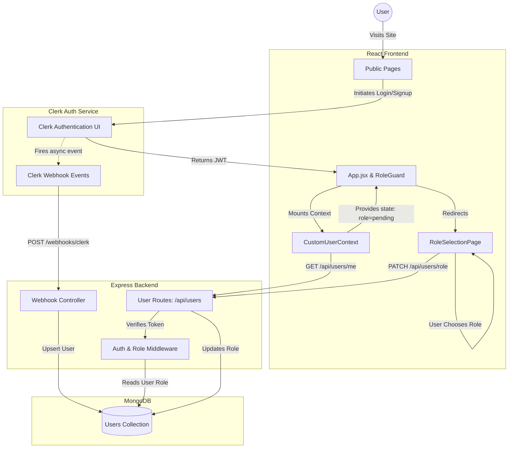

# Phase 1: Foundation and Authentication

**Goal:** Establish the core infrastructure, database connection, and user identity management with role support.

---

## Subphase 1: Backend Setup & Health Check

Initialize the backend Node.js and Express server with a clear folder structure and base dependencies.

- **How:** Create the backend directory, initialize a standard Node project, install dependencies (Express, dotenv, cors, etc.), and set up a health check route (`GET /api/health`).
- **Verification Checklist:**
  - [ ] Running the backend server locally prints a startup log without errors.
  - [ ] Sending a GET request to `/api/health` via Postman returns a successful response (e.g., `status: "OK"`).

---

## Subphase 2: Database Connection & Configuration

Configure database connectivity using Mongoose to interact with MongoDB.

- **How:** Connect to MongoDB (local or cloud instance) via Mongoose, utilizing configuration from environment variables, and include basic error handling for database failures.
- **Verification Checklist:**
  - [ ] Launching the server displays a "Database connected successfully" confirmation log.
  - [ ] Temporarily changing the database URL in the environment variables logs a clear connection failure message when starting the server.

---

## Subphase 3: User Schema Definition

Create the structure for holding user profiles, supporting roles of buyer, seller, and admin.

- **How:** Write a Mongoose schema for Users specifying `clerkId`, `email`, `role`, and other basic user details.
- **Verification Checklist:**
  - [ ] Saving a test user directly in the database manually or via a quick script works without schema validation errors.
  - [ ] Querying the database displays the record with all fields matching the schema.

---

## Subphase 4: Backend Clerk Authentication Integration

Verify user identity and sync incoming authenticated requests with our MongoDB users collection.

- **How:** Integrate the Clerk SDK middleware on the backend. Create a sync endpoint (e.g., `POST /api/users/sync`) that verifies the token, checks if the user exists in our database, and registers them if they do not.
- **Verification Checklist:**
  - [ ] Sending an unauthenticated request to a protected backend route receives a 401 Unauthorized response.
  - [ ] Sending a request with a valid Clerk session token to the sync endpoint creates a new user record in MongoDB matching the Clerk profile.

---

## Subphase 5: Role-Based Authorization Middleware

Control access to specific resources based on the user's assigned role.

- **How:** Write middleware that reads the requesting user's role and grants or denies access based on allowed roles for that route.
- **Verification Checklist:**
  - [ ] Making an authorized request (e.g., accessing seller routes as a seller) successfully returns the data.
  - [ ] Making an unauthorized request (e.g., accessing seller routes as a buyer) returns a 403 Forbidden response.

---

## Subphase 6: Frontend Scaffolding & Clerk Setup

Set up the React application using Vite and configure user authentication.

- **How:** Scaffold a React application using Vite, clean up the boilerplate, install Clerk's React SDK, and wrap the application with the auth provider.
- **Verification Checklist:**
  - [ ] Starting the frontend development server opens the app in the browser.
  - [ ] Accessing the sign-in/sign-up components displays the Clerk forms correctly.

---

## Subphase 7: Frontend to Backend Integration

Connect the frontend and backend so authenticated sessions are synced and authenticated API requests work.

- **How:** Implement the post-login trigger in the React app that calls the backend's sync route. Set up an API handler that automatically attaches the Clerk session token to header requests.
- **Verification Checklist:**
  - [ ] Signing up a new user via the React frontend triggers integration.
  - [ ] Sending a request from the frontend to a protected backend API route succeeds and uses the active session token.

---

## Subphase 8: Clerk Webhooks for Reliable Database Registration (Missing Piece)

Relying solely on frontend syncing causes bugs where users sign up in Clerk but are missing in the database if the frontend sync fails or the browser closes.

- **How:** Set up a backend endpoint (e.g., `POST /api/webhooks/clerk`) utilizing `svix` to verify Clerk webhook signatures. Listen for `user.created`, `user.updated`, and `user.deleted` events to reliably register and sync users in MongoDB completely independent of the frontend.
- **Verification Checklist:**
  - [x] Bypassing the frontend entirely, creating a given user directly in the Clerk dashboard successfully triggers the webhook and inserts them into MongoDB.
  - [x] Deleting a user in Clerk propagates to MongoDB.

---

## Subphase 9: User Role Selection & Database Seeding

Users need to pick their role during registration, and developers need initial admin access.

- **How:** Configure the Clerk sign-up form to include a custom field for role selection (e.g. seller). Ensure the `user.created` webhook reads this custom attribute and assigns the role in MongoDB accordingly. Strict security and admin access management will be enhanced later. Write a `seed.js` script to establish the first admin user and insert mock data.
- **Verification Checklist:**
  - [x] Running the seed script correctly populates the database with an admin user.
  - [x] A user creating an account via the Clerk sign-up form can select a role, which is successfully saved in the database via the webhook.

---

# Final Verification Checklist

Use this checklist to verify that all parts of Phase 1 are fully integrated and functional:

- [x] **Backend Health Check:** `GET /api/health` returns status OK.
- [x] **Database Connection:** Backend logs successful connection to MongoDB.
- [x] **Mongoose User Schema:** User records can be saved and retrieved with all fields (including role).
- [x] **Backend Authentication:** Routes require valid Clerk tokens; unauthenticated calls are rejected with 401 Unauthorized.
- [x] **Clerk Webhooks (Registration):** `user.created` webhook accurately creates DB instances, eliminating desync bugs.

- [x] **Frontend Environment:** React application starts up and renders without console errors.
- [x] **Frontend Authentication:** Clerk SignUp/SignIn flows work and authenticate the user.
- [x] **Authenticated API Calls:** Frontend successfully calls protected backend API endpoints using the Clerk JWT token.

# Implemented in 1.5:
- [x] **User Role Operations:** Users can select their role during sign-up
- [x] **Role Authorization Middleware:** Users are restricted from endpoints that do not match their assigned role (e.g. 403 Forbidden).

# Current Architecture & Flow (Phase 1 & 1.5)

