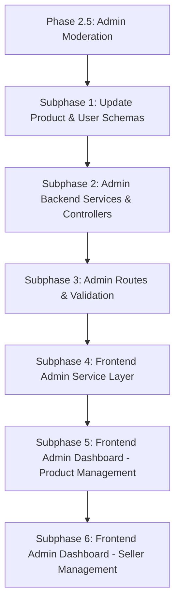
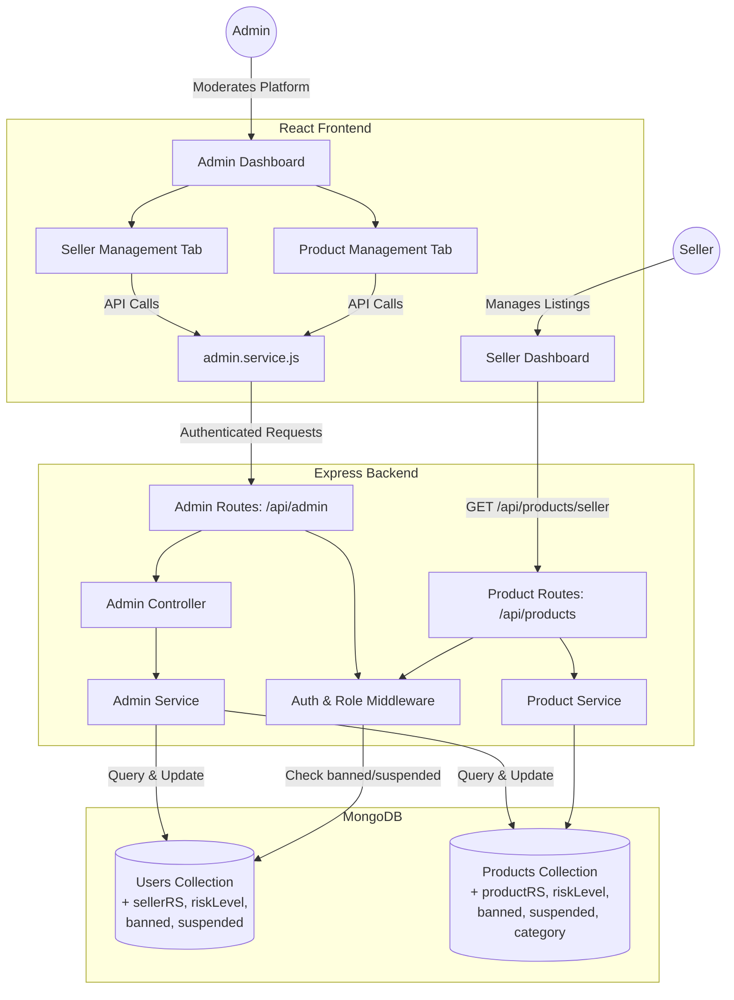

# Phase 2.5: Admin Moderation Dashboard for Product Management

**Goal:** Allow admins to view, filter, and manage all product listings and sellers on the platform. Introduce Risk Scores (`productRS` / `sellerRS`) categorized as High, Medium, or Low. Enable admin actions: approve, reject, ban, suspend, unban, and unsuspend products and sellers. Update schemas to replace `aiConfidence`/`aiReasoning` with the new risk score and moderation flag fields.

---

## Subphase 1: Update Product & User Schemas

Modify both the Product and User models to support risk scoring and moderation flags.

- **How:**
  - **Product Model** (`backend/src/modules/products/product.model.js`):
    - Remove `aiConfidence` (Number) and `aiReasoning` (String).
    - Add `productRS` (Number, default: `null`, min: 0, max: 100) — the product risk score, to be evaluated by AI later.
    - Add `riskLevel` (String, enum: `['low', 'medium', 'high']`, default: `null`) — derived from `productRS` thresholds (0–39 = low, 40–69 = medium, 70–100 = high).
    - Add `banned` (Boolean, default: `false`) — hard block, product is completely removed from public view.
    - Add `suspended` (Boolean, default: `false`) — soft block, product is temporarily hidden but can be reinstated.
    - Add `category` (String, required) — product category for filtering.
    - Update `status` enum to include `approved`: `['pending_review', 'published', 'approved', 'flagged', 'rejected']`.
    - Add index on `riskLevel`.
  - **User Model** (`backend/src/modules/users/user.model.js`):
    - Add `sellerRS` (Number, default: `null`, min: 0, max: 100) — the seller risk score, to be evaluated by AI later.
    - Add `riskLevel` (String, enum: `['low', 'medium', 'high']`, default: `null`) — derived from `sellerRS` thresholds.
    - Add `banned` (Boolean, default: `false`).
    - Add `suspended` (Boolean, default: `false`).
- **Verification Checklist:**
  - [ ] Product schema no longer contains `aiConfidence` or `aiReasoning`.
  - [ ] Product schema includes `productRS`, `riskLevel`, `banned`, `suspended`, and `category`.
  - [ ] User schema includes `sellerRS`, `riskLevel`, `banned`, and `suspended`.
  - [ ] Existing product creation still works after schema changes (test via Postman with `category` included).
  - [ ] Default values are correctly applied (`banned: false`, `suspended: false`, `productRS: null`).

---

## Subphase 2: Admin Backend Services & Controllers

Build the admin-specific business logic for managing products and sellers.

- **How:**
  - Create a new module `backend/src/modules/admin/` containing:
    - `admin.service.js` — Admin-specific service methods:
      - `getAllProducts(filters)` — Fetch all products with optional filters (status, riskLevel, banned, suspended, category, search query). Support pagination (`page`, `limit`). Populate seller info.
      - `updateProductStatus(productId, status)` — Approve or reject a product.
      - `updateProductModeration(productId, { banned, suspended })` — Ban/unban, suspend/unsuspend a product.
      - `getAllSellers(filters)` — Fetch all users with `role: 'seller'` with optional filters (riskLevel, banned, suspended). Support pagination. Include aggregated product count per seller.
      - `updateSellerModeration(sellerId, { banned, suspended })` — Ban/unban, suspend/unsuspend a seller.
      - `getDashboardStats()` — Return counts: total products, products by status, products by riskLevel, total sellers, flagged items count.
    - `admin.controller.js` — Thin controllers that extract request data, call the service, and return standardized responses.
  - Follow the "fat service, skinny controller" pattern established in Phase 2.
- **Verification Checklist:**
  - [ ] `admin.service.js` methods correctly query MongoDB with filters and pagination.
  - [ ] `admin.controller.js` returns standard `{ success, data }` / `{ success, message }` responses.
  - [ ] `getAllProducts` correctly populates seller name/email from the User collection.
  - [ ] `getDashboardStats` returns accurate aggregated counts.

---

## Subphase 3: Admin Routes & Validation

Expose admin functionalities via secured RESTful API endpoints.

- **How:**
  - Create `admin.routes.js` and `admin.validation.js` in `backend/src/modules/admin/`.
  - All routes are prefixed under `/api/admin` and protected with `[requireAuth, attachUser, requireRole(['admin'])]`.
  - Routes:
    - `GET /api/admin/products` — List all products with query filters (`status`, `riskLevel`, `banned`, `suspended`, `category`, `search`, `page`, `limit`).
    - `PATCH /api/admin/products/:id/status` — Update product status (approve/reject). Body: `{ status: 'approved' | 'rejected' }`.
    - `PATCH /api/admin/products/:id/moderation` — Update product moderation flags. Body: `{ banned?: boolean, suspended?: boolean }`.
    - `GET /api/admin/sellers` — List all sellers with query filters (`riskLevel`, `banned`, `suspended`, `search`, `page`, `limit`).
    - `PATCH /api/admin/sellers/:id/moderation` — Update seller moderation flags. Body: `{ banned?: boolean, suspended?: boolean }`.
    - `GET /api/admin/stats` — Dashboard summary statistics.
  - `admin.validation.js` — Validate:
    - `status` field is one of the allowed enum values.
    - `banned` and `suspended` are booleans.
    - `page` and `limit` are positive integers.
    - `:id` params are valid MongoDB ObjectIds.
  - Register the admin routes in the main server/routes file.
- **Verification Checklist:**
  - [ ] Non-admin users receive 403 Forbidden on all `/api/admin/*` routes.
  - [ ] Unauthenticated users receive 401 Unauthorized.
  - [ ] `GET /api/admin/products` returns paginated products with filter support.
  - [ ] `PATCH /api/admin/products/:id/status` with `{ status: "approved" }` updates the product status in the database.
  - [ ] `PATCH /api/admin/products/:id/moderation` with `{ banned: true }` updates the product's banned flag.
  - [ ] `PATCH /api/admin/sellers/:id/moderation` with `{ suspended: true }` updates the seller's suspended flag.
  - [ ] Invalid inputs (e.g., non-boolean `banned`, invalid status) are rejected with 400.

---

## Subphase 4: Frontend Admin Service Layer

Create the frontend data-fetching layer for admin operations.

- **How:**
  - Create `frontend/src/services/admin.service.js` following the existing pattern in `product.service.js`.
  - Methods:
    - `getProducts(filters)` — `GET /api/admin/products` with query params.
    - `updateProductStatus(productId, status)` — `PATCH /api/admin/products/:id/status`.
    - `updateProductModeration(productId, flags)` — `PATCH /api/admin/products/:id/moderation`.
    - `getSellers(filters)` — `GET /api/admin/sellers`.
    - `updateSellerModeration(sellerId, flags)` — `PATCH /api/admin/sellers/:id/moderation`.
    - `getStats()` — `GET /api/admin/stats`.
  - Use the existing `api.js` authenticated fetch wrapper.
- **Verification Checklist:**
  - [ ] All service methods correctly call the API and return parsed JSON responses.
  - [ ] Error responses from the API are properly propagated.

---

## Subphase 5: Frontend Admin Dashboard — Product Management

Build the admin product management interface.

- **How:**
  - Create `frontend/src/pages/admin/AdminDashboard.jsx` — The main admin page.
  - **Layout Description:**
    - **Top section:** Dashboard stats bar — total products, pending, flagged, approved, rejected counts displayed as metric cards with icons and color coding. Use a dark, professional theme distinct from the seller dashboard.
    - **Visually distinctive element:** A live "Risk Distribution" mini-chart or heatmap showing product distribution across risk levels (low/medium/high) with animated count-up numbers.
    - **Filter bar:** Horizontally laid out filter chips/dropdowns for status, risk level, banned/suspended state, category, and a search input. Filters feel interactive with smooth transitions.
    - **Product table/grid:** A clean data table (using `shadcn/ui` Table) displaying columns: Product Title, Seller Name, Price, Status (color-coded badge), Risk Level (color-coded badge: green/yellow/red), Banned/Suspended flags (icons), Created Date.
    - **Row actions:** Each row has action buttons — Approve, Reject, Ban, Suspend, with confirmation dialogs (using `shadcn/ui` AlertDialog) before destructive actions.
    - **Pagination:** Bottom pagination controls.
  - Use Framer Motion for:
    - Page entry animation.
    - Table row stagger reveal.
    - Status badge transitions when actions are taken.
  - Add `AdminGuard` component in `App.jsx` that restricts access to admin-only routes.
  - Register route: `/admin/dashboard`.
- **Verification Checklist:**
  - [ ] Admin Dashboard successfully fetches and displays all products with populated seller data.
  - [ ] Filters correctly narrow down the product list.
  - [ ] Clicking "Approve" on a pending product updates its status and reflects in the UI.
  - [ ] Clicking "Ban" on a product shows a confirmation dialog and updates the flag in the database.
  - [ ] Risk level badges display correct colors (green for low, yellow for medium, red for high).
  - [ ] Pagination works correctly.
  - [ ] The layout is fully responsive (mobile, tablet, desktop).
  - [ ] Only admin users can access the dashboard.

---

## Subphase 6: Frontend Admin Dashboard — Seller Management

Extend the admin dashboard with a seller management view.

- **How:**
  - Add a tabbed navigation or secondary view within the Admin Dashboard for "Sellers".
  - **Seller table** (using `shadcn/ui` Table) displaying columns: Seller Name, Email, Seller Risk Score (color-coded), Total Products, Banned/Suspended status (toggle icons), Joined Date.
  - **Row actions:** Ban, Suspend, Unban, Unsuspend with confirmation dialogs.
  - **Seller detail expansion:** Clicking a seller row expands to show their recent product listings inline.
  - Use the same filter bar pattern: risk level, banned/suspended state, search.
  - Use Framer Motion for tab transitions and row expansions.
- **Verification Checklist:**
  - [ ] Seller tab displays all sellers with correct risk scores and product counts.
  - [ ] Banning a seller via the UI updates the database and reflects immediately.
  - [ ] Suspending a seller via the UI updates the database and reflects immediately.
  - [ ] Expanding a seller row shows their product listings.
  - [ ] Filters and search work correctly for sellers.
  - [ ] The layout is fully responsive.

---

## Subphase 7: Update Existing Flows for Moderation Compatibility

Ensure that banned/suspended flags are respected across the existing system.

- **How:**
  - **Product queries:** Update `getAllPublishedProducts` in `product.service.js` to exclude products where `banned: true` or `suspended: true`.
  - **Seller access:** Update `attachUser` middleware or add a new middleware check — if a seller is banned or suspended, reject their requests with a 403 and an appropriate message ("Your account has been banned/suspended").
  - **Seller Dashboard:** If the logged-in seller is suspended, show a notice banner on their dashboard. If banned, redirect to a "Your account has been banned" page.
  - Update the product creation validation to include the new `category` field as required.
  - Update the frontend `NewProductPage.jsx` to include a category selector.
- **Verification Checklist:**
  - [ ] Banned products do not appear in public product listings (`GET /api/products`).
  - [ ] Suspended products do not appear in public product listings.
  - [ ] A banned seller cannot create new products (receives 403).
  - [ ] A suspended seller sees a suspension notice on their dashboard.
  - [ ] New product form includes a category field.
  - [ ] Existing seller dashboard continues to work without regressions.

---

# Final Verification Checklist

Use this checklist to verify that all parts of Phase 2.5 are thoroughly functional together:

- [x] **Schema Updates:** Product model uses `productRS`, `riskLevel`, `banned`, `suspended`, `category` — no `aiConfidence`/`aiReasoning`. User model uses `sellerRS`, `riskLevel`, `banned`, `suspended`.
- [x] **Admin API — Products:** `GET /api/admin/products` returns paginated, filterable products with seller data populated.
- [x] **Admin API — Status:** `PATCH /api/admin/products/:id/status` correctly approves/rejects products.
- [x] **Admin API — Moderation:** `PATCH /api/admin/products/:id/moderation` correctly bans/suspends/unbans/unsuspends products.
- [x] **Admin API — Sellers:** `GET /api/admin/sellers` returns paginated, filterable seller list with product counts.
- [x] **Admin API — Seller Moderation:** `PATCH /api/admin/sellers/:id/moderation` correctly bans/suspends/unbans/unsuspends sellers.
- [ ] **Admin API — Stats:** `GET /api/admin/stats` returns accurate dashboard statistics.
- [x] **Security:** All admin routes are restricted to admin role only (403 for non-admins, 401 for unauthenticated).
- [x] **Admin Dashboard UI:** Products tab displays all products with correct status/risk badges and functional action buttons.
- [x] **Admin Dashboard UI:** Sellers tab displays all sellers with correct risk scores, product counts, and functional moderation actions.
- [ ] **Moderation Enforcement:** Banned/suspended products are excluded from public listings. Banned sellers cannot access seller routes.
- [x] **Responsiveness:** Admin dashboard is fully responsive across mobile, tablet, and desktop.
- [x] **No Regressions:** Existing seller dashboard and product creation flows continue to work correctly with the schema changes.

# Current Architecture & Flow (Phase 2.5)

# TODO:
- Risk scores (`productRS` / `sellerRS`) will remain `null` until Phase 3 when AI evaluation is integrated.
- Consider adding bulk moderation actions (approve/reject multiple products at once) in a later phase.
- Add email/notification system to inform sellers when their products are approved/rejected/banned.
