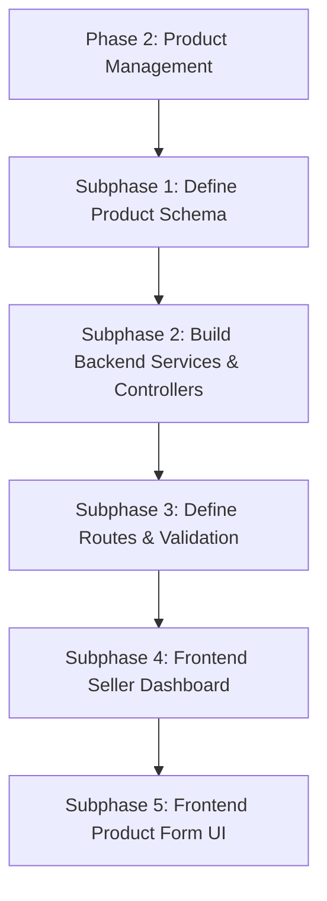
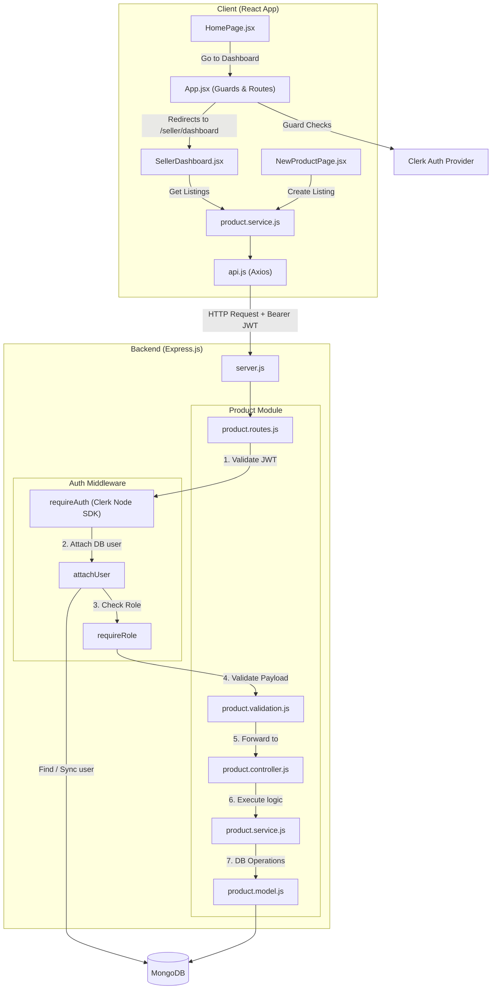

# Phase 2: Product Management System

**Goal:** Allow sellers to create, view, and manage their product listings on the platform.

## Architecture Diagram

## Subphase 1: Define Product Schema in Database

Establish the MongoDB collection for products, linking them to their respective sellers.

- **How:** Create `product.model.js` inside `backend/src/modules/products/`. Include fields: `title`, `description`, `price`, `sellerId` (Reference to User), `status` (Enum: `pending_review`, `published`, `flagged`, `rejected`, default: `pending_review`), `aiConfidence` (Number), and `aiReasoning` (String). Add indexes for faster querying by `sellerId` and `status`.
- **Verification Checklist:**
  - [ ] `product.model.js` is created and correctly exported.
  - [ ] The schema includes proper validations (e.g., price > 0, required fields).

## Subphase 2: Build Backend Services & Controllers

Implement the core business logic and request handlers for product CRUD operations.

- **How:** Create `product.service.js` to handle database interactions (e.g., `createProduct`, `getProductsBySeller`, `getAllPublishedProducts`, `updateProduct`, `deleteProduct`). Create `product.controller.js` to handle incoming requests, extract data, call the service, and send consistent success/failure responses. Follow the "fat service, skinny controller" pattern.
- **Verification Checklist:**
  - [ ] Service methods correctly interact with the MongoDB `Product` model.
  - [ ] Controllers use standard response formats (`success`, `message`/`data`).
  - [ ] No internal server stack traces are exposed on errors.

## Subphase 3: Define Routes & Validation

Expose the product functionalities via RESTful API endpoints and secure them.

- **How:** Create `product.routes.js` and `product.validation.js`. 
  - `POST /api/products` (Requires Seller role)
  - `GET /api/products` (Public, returns only `published` items)
  - `GET /api/products/seller` (Requires Seller role)
  - `GET /api/products/:id` (Public)
  - `PATCH /api/products/:id` (Requires Seller role, verify ownership)
  - `DELETE /api/products/:id` (Requires Seller role, verify ownership)
  Use the existing role middleware to protect seller routes. Implement input validation middleware using the defined schema.
- **Verification Checklist:**
  - [ ] Unauthorized users cannot create/edit products (Returns 401/403).
  - [ ] Invalid product data (e.g., negative price, missing title) is rejected by validation middleware with a 400 status.
  - [ ] Sellers can successfully create a product via Postman and receive a 201 response.
  - [ ] Sellers can only edit or delete their *own* products.

## Subphase 4: Develop Frontend Seller Dashboard

Create the interface where sellers can view all their submitted listings and their statuses.

- **How:** Create a visually distinctive `SellerDashboard.jsx` in `frontend/src/pages/seller/`. Use `frontend/src/services/product.service.js` to fetch data from `GET /api/products/seller`. Display products using a table or grid component from `shadcn/ui`. Show the current AI review status (`pending_review`, `published`, etc.) with clear, color-coded badges. Add Framer Motion for page transitions or list item reveals.
- **Verification Checklist:**
  - [ ] Seller Dashboard successfully fetches and displays the logged-in seller's products.
  - [ ] The UI cleanly indicates the status of each product (e.g., yellow for pending, green for published).
  - [ ] The layout is fully responsive (mobile, tablet, desktop).

## Subphase 5: Frontend Product Creation/Editing Form

Provide a polished form for sellers to add new items or modify existing ones.

- **How:** Create `ProductForm.jsx` and `NewProductPage.jsx` components. Handle local form state, integrate with `shadcn/ui` inputs, and make the API call to `POST /api/products`. Use client-side validation to mirror backend rules. Upon success, redirect back to the Seller Dashboard. 
- **Verification Checklist:**
  - [ ] A seller can successfully submit a new product via the UI.
  - [ ] Client-side validation prevents submission of empty or invalid data.
  - [ ] Successful submission creates the product in the DB and reflects on the dashboard.

---

# Final Verification Checklist

Use this checklist to verify that all parts of Phase 2 are thoroughly functional together:

- [x] **Schema & DB:** `product.model.js` is created and correctly exported with proper schema validations.
- [x] **Service & Logic:** Service methods interact with MongoDB correctly, and controllers return standardized responses.
- [x] **Validation:** Invalid product data is blocked by validation middleware (400 Bad Request).
- [ ] **Security:** Routes are protected; buyers/unauthenticated users cannot access seller routes (401/403).
- [ ] **Ownership:** Sellers can only edit or delete their own products.
- [x] **API Functional:** Postman can successfully create, read, update, and delete products using a seller token.
- [x] **Seller Dashboard UI:** Frontend fetches and displays the seller's products with correct, color-coded status indicators.
- [ ] **Responsiveness:** Dashboard and forms look excellent and function correctly on mobile, tablet, and desktop.
- [x] **Product Form UI:** Frontend form successfully validates input, submits to the API, and creates a product.

# TODO Right Now:
- Use mongooose!

# TODO:
- Consider adding image upload capabilities for products (e.g., using Cloudinary or AWS S3) later in Phase 2 or 3.
- Check for Protected Routes later when other roles are implemented!
- Frontend UI/UX Sucks!