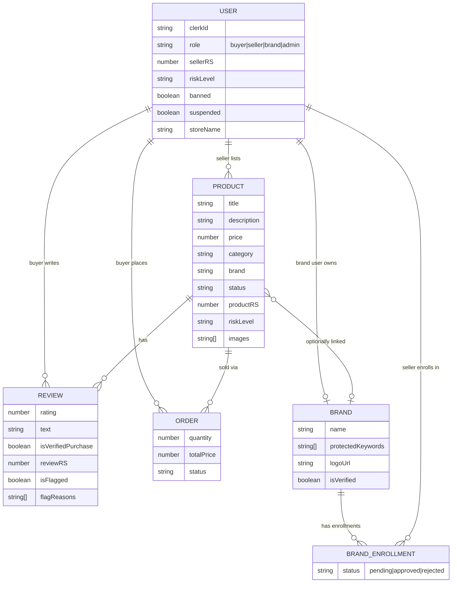

# Phase 3: Marketplace Platform Foundation

**Goal:** Build a functional e-commerce marketplace (Amazon-inspired) with all four roles (Buyer, Seller, Brand, Admin), a complete product browsing experience, reviews, and a database schema designed to support the fraud detection solutions from our research. The platform must feel real enough that fraud *can* actually take place, giving our AI detection layers something to work against.

> **Philosophy:** We're not building Amazon. We're building the *minimum believable marketplace* so our fraud detection has a realistic surface to protect. Only the features that directly enable fraud scenarios (listing, buying, reviewing, brand enrollment) are included.

---

## 🔑 Role Authority Matrix

Before touching any code, here's exactly what each role can do:

| Capability | Buyer | Seller | Brand | Admin |
|:---|:---:|:---:|:---:|:---:|
| Browse & search products | ✅ | ✅ | ✅ | ✅ |
| View product detail page | ✅ | ✅ | ✅ | ✅ |
| Leave a review on purchased/viewed products | ✅ | ❌ | ❌ | ❌ |
| Edit/delete own reviews | ✅ | ❌ | ❌ | ❌ |
| View order history | ✅ | ❌ | ❌ | ❌ |
| Create product listings | ❌ | ✅ | ❌ | ❌ |
| Manage own listings (edit/delete) | ❌ | ✅ | ❌ | ❌ |
| View own seller dashboard (listings, stats) | ❌ | ✅ | ❌ | ❌ |
| View own trust score & risk level | ❌ | ✅ | ❌ | ❌ |
| Enroll into a Brand program | ❌ | ✅ | ❌ | ❌ |
| View store page (public seller profile) | ✅ | ✅ | ✅ | ✅ |
| Register brand & set protected keywords/logos | ❌ | ❌ | ✅ | ❌ |
| View enrolled sellers' trust scores & analysis | ❌ | ❌ | ✅ | ❌ |
| View enrolled sellers' products & reviews | ❌ | ❌ | ✅ | ❌ |
| Approve/reject seller brand enrollment | ❌ | ❌ | ✅ | ❌ |
| View brand dashboard (own brand analytics) | ❌ | ❌ | ✅ | ❌ |
| View ALL trust scores & analysis (platform-wide) | ❌ | ❌ | ❌ | ✅ |
| Moderate ALL products (approve/reject/ban/suspend) | ❌ | ❌ | ❌ | ✅ |
| Moderate ALL sellers (ban/suspend) | ❌ | ❌ | ❌ | ✅ |
| Moderate ALL reviews (remove/flag) | ❌ | ❌ | ❌ | ✅ |
| View platform-wide analytics & stats | ❌ | ❌ | ❌ | ✅ |
| Access flagged items feed | ❌ | ❌ | ❌ | ✅ |

### Key Distinctions:
- **Brand vs Admin:** Brand sees trust scores/analysis ONLY for sellers enrolled under their brand. Admin sees EVERYTHING across the entire platform.
- **Buyer** is the only role that can leave reviews — this is critical for the fake review detection system.
- **Seller** can see their *own* risk score but cannot see other sellers' scores.

---

## 📊 Database Schema Redesign

### Why a Redesign?

The current schema only has `User` and `Product`. To support the solutions from our research docs, we need:
- **Reviews** (for fake review detection via DistilBERT + Graph + XGBoost)
- **Brands** (for counterfeit prevention — brand enrollment, image-text verification)
- **Orders** (to track verified purchases — critical for review legitimacy)
- **Brand Enrollments** (seller ↔ brand relationship for brand authority)
- Extended User fields (for graph features: device/IP tracking, review velocity)
- Extended Product fields (for image URLs — counterfeit image-text verification)

### Schema Changes Overview

#### 1. User Model — MODIFY (`user.model.js`)

**Add fields:**
```
- role: add 'brand' to enum → ['pending', 'buyer', 'seller', 'brand', 'admin']
- profileImageUrl: String (for store page)
- storeName: String (sellers only — for store page)
- storeDescription: String (sellers only)
- reviewCount: Number, default 0 (denormalized — how many reviews this buyer has written)
- totalReviewsReceived: Number, default 0 (sellers — aggregate across all their products)
- averageRating: Number, default 0 (sellers — aggregate)
- lastActiveAt: Date (for graph temporal features later)
```

**Keep existing:** clerkId, email, firstName, lastName, avatarUrl, sellerRS, riskLevel, banned, suspended, timestamps

#### 2. Product Model — MODIFY (`product.model.js`)

**Add fields:**
```
- images: [String] (array of image URLs — needed for MLLM image-text verification Layer 3)
- brand: String (declared brand name — for counterfeit cross-referencing)
- brandId: ObjectId, ref 'Brand' (optional — if seller is enrolled under a registered brand)
- averageRating: Number, default 0 (denormalized)
- reviewCount: Number, default 0 (denormalized)
- totalSales: Number, default 0 (for transactional anomaly detection Layer 1)
- salesVelocity: Number, default 0 (rolling sales rate — for IsolationForest)
```

**Keep existing:** title, description, price, category, sellerId, status, productRS, riskLevel, banned, suspended, timestamps

#### 3. Review Model — NEW (`review.model.js`)

```javascript
{
  productId: ObjectId, ref 'Product', required, index
  buyerId: ObjectId, ref 'User', required, index
  sellerId: ObjectId, ref 'User', required, index  // denormalized for graph queries
  rating: Number, required, min 1, max 5
  title: String, trim
  text: String, required, trim
  isVerifiedPurchase: Boolean, default false  // did the buyer actually order this?
  
  // AI Analysis fields (populated by ML microservice later)
  reviewRS: Number, default null, min 0, max 100  // Review Risk Score
  riskLevel: String, enum ['low', 'medium', 'high', null], default null
  isFlagged: Boolean, default false
  flagReasons: [String]  // e.g., ["text_similarity_high", "burst_timing", "graph_cluster"]
  
  // Metadata for graph & temporal analysis
  deviceFingerprint: String  // for graph nodes: Device/IP
  ipAddress: String
  
  // Moderation
  isRemoved: Boolean, default false  // admin removed
  removedReason: String

  timestamps: true
}

// Compound index: one review per buyer per product
index: { productId: 1, buyerId: 1 }, unique: true
index: { sellerId: 1 }
index: { riskLevel: 1 }
index: { isFlagged: 1 }
```

#### 4. Order Model — NEW (`order.model.js`)

Lightweight — just enough to prove "verified purchase" and track sales velocity.

```javascript
{
  buyerId: ObjectId, ref 'User', required, index
  sellerId: ObjectId, ref 'User', required, index  // denormalized
  productId: ObjectId, ref 'Product', required, index
  quantity: Number, required, min 1, default 1
  totalPrice: Number, required
  status: String, enum ['completed', 'cancelled', 'refunded'], default 'completed'
  
  timestamps: true  // createdAt = order date, needed for velocity calc
}
```

> **Note:** We're NOT building a full checkout/payment system. Orders are simulated — a buyer clicks "Buy Now" and an order record is created instantly. This is just to establish purchase legitimacy for reviews and sales velocity for anomaly detection.

#### 5. Brand Model — NEW (`brand.model.js`)

```javascript
{
  name: String, required, unique, trim
  ownerId: ObjectId, ref 'User', required, index  // the 'brand' role user who owns this
  description: String, trim
  logoUrl: String
  protectedKeywords: [String]  // e.g., ["Nike", "Air Max", "Just Do It"]
  category: String  // primary product category
  isVerified: Boolean, default true  // admin-verified brand (auto-true for hackathon)
  
  timestamps: true
}
```

#### 6. Brand Enrollment Model — NEW (`brandEnrollment.model.js`)

Links sellers to brands. Brand owners can see enrolled sellers' data.

```javascript
{
  brandId: ObjectId, ref 'Brand', required, index
  sellerId: ObjectId, ref 'User', required, index
  status: String, enum ['pending', 'approved', 'rejected'], default 'pending'
  appliedAt: Date, default Date.now
  reviewedAt: Date

  timestamps: true
}

// Compound index: one enrollment per seller per brand
index: { brandId: 1, sellerId: 1 }, unique: true
```

### Schema Relationship Diagram



---

## 🖥️ Frontend — Amazon-Inspired Pages

We're keeping ONLY the pages that serve the fraud detection demo. Styled to look and feel like Amazon but stripped to essentials.

### Pages to Build

| Page | Route | Role | Purpose |
|:---|:---|:---|:---|
| **Home Page** | `/` | Public | Amazon-style landing: search bar, category cards, featured products grid, deals section |
| **Search Results** | `/search?q=...&category=...` | Public | Filtered product grid with sidebar filters (category, price range, rating), sort options |
| **Product Detail** | `/products/:id` | Public | Product images, title, price, description, seller info link, "Buy Now" button, reviews section |
| **Store Page** | `/seller/:id/store` | Public | Seller's public profile: store name, rating, all their products listed |
| **Sign In / Sign Up** | `/sign-in`, `/sign-up` | Public | Clerk auth (already exists) |
| **Role Selection** | `/select-role` | Auth | Choose: Buyer, Seller, or Brand (already exists, needs Brand added) |
| **Seller Dashboard** | `/seller/dashboard` | Seller | Existing — needs UI overhaul to match Amazon seller-central style |
| **New Product** | `/seller/new` | Seller | Existing — add image URLs, brand field |
| **Brand Dashboard** | `/brand/dashboard` | Brand | Brand overview: enrolled sellers list, their trust scores, flagged products under brand |
| **Admin Dashboard** | `/admin/dashboard` | Admin | Existing — needs review moderation tab added |

### Frontend Design Direction

**Amazon-Inspired, Not Amazon-Cloned:**
- Top navigation bar: logo, search bar (with category dropdown), user account dropdown, cart icon (non-functional, for looks)
- Color palette: Dark navy header (#131921), orange accents (#FF9900), white content area
- Product cards: image, title, star rating, price, "Prime-like" badge for verified sellers
- Clean, dense information layout — Amazon's strength is information density done right

### Key Frontend Components to Build

1. **Navbar** — Amazon-style with search, category filter, user menu
2. **ProductCard** — Reusable card: image, title, stars, price, seller name
3. **StarRating** — Interactive (for review form) and display-only
4. **ReviewCard** — Review text, rating, buyer name, verified purchase badge, date
5. **ReviewForm** — Rating selector + text input for buyers
6. **SearchBar** — With category dropdown and query params
7. **FilterSidebar** — Category, price range, rating filters
8. **CategoryCard** — Clickable category tiles for home page

---

## 🏗️ Implementation Subphases

### Subphase 1: Database Schema Migration

Update existing models and create new ones.

**Files:**
- **[MODIFY]** `backend/src/modules/users/user.model.js` — Add 'brand' role, storeName, storeDescription, reviewCount, etc.
- **[MODIFY]** `backend/src/modules/products/product.model.js` — Add images, brand, brandId, averageRating, reviewCount, totalSales, salesVelocity
- **[NEW]** `backend/src/modules/reviews/review.model.js` — Full review schema
- **[NEW]** `backend/src/modules/orders/order.model.js` — Lightweight order schema
- **[NEW]** `backend/src/modules/brands/brand.model.js` — Brand registry schema
- **[NEW]** `backend/src/modules/brands/brandEnrollment.model.js` — Seller ↔ Brand linkage

**Verification:**
- [ ] All models compile without errors
- [ ] Creating a test review with compound index works (one review per buyer per product)
- [ ] User model accepts 'brand' role
- [ ] Product model accepts images array and brand string

---

### Subphase 2: Review Module — Backend

Build the complete review CRUD system.

**Files:**
- **[NEW]** `backend/src/modules/reviews/review.service.js`
- **[NEW]** `backend/src/modules/reviews/review.controller.js`
- **[NEW]** `backend/src/modules/reviews/review.routes.js`
- **[NEW]** `backend/src/modules/reviews/review.validation.js`

**Endpoints:**
| Method | Route | Auth | Description |
|:---|:---|:---|:---|
| `POST` | `/api/reviews` | Buyer | Create a review (rating, title, text, productId) |
| `GET` | `/api/reviews/product/:productId` | Public | Get all reviews for a product (paginated) |
| `GET` | `/api/reviews/user/:userId` | Public | Get all reviews by a user |
| `PATCH` | `/api/reviews/:id` | Buyer (owner) | Edit own review |
| `DELETE` | `/api/reviews/:id` | Buyer (owner) or Admin | Delete a review |

**Business Logic:**
- On review creation: check if buyer already reviewed this product (compound index enforces uniqueness)
- On review creation: check if buyer has an order for this product → set `isVerifiedPurchase: true`
- On review create/update/delete: recalculate product's `averageRating` and `reviewCount`
- On review create/update/delete: recalculate seller's `averageRating` and `totalReviewsReceived`

**Verification:**
- [ ] Buyer can create a review via Postman
- [ ] Duplicate review for same product by same buyer returns 409
- [ ] Product's averageRating updates after review creation
- [ ] Non-buyers get 403 when trying to create a review
- [ ] Admin can delete any review

---

### Subphase 3: Order Module — Backend (Simplified)

Lightweight order system — just "Buy Now" creates an order record.

**Files:**
- **[NEW]** `backend/src/modules/orders/order.service.js`
- **[NEW]** `backend/src/modules/orders/order.controller.js`
- **[NEW]** `backend/src/modules/orders/order.routes.js`
- **[NEW]** `backend/src/modules/orders/order.validation.js`

**Endpoints:**
| Method | Route | Auth | Description |
|:---|:---|:---|:---|
| `POST` | `/api/orders` | Buyer | Create an order (productId, quantity) |
| `GET` | `/api/orders/my` | Buyer | Get buyer's order history |
| `GET` | `/api/orders/seller` | Seller | Get orders for seller's products |

**Business Logic:**
- On order creation: increment product's `totalSales`
- Price calculated server-side from product price × quantity
- `sellerId` denormalized from product

**Verification:**
- [ ] Buyer can create an order
- [ ] Product's totalSales increments
- [ ] Seller can see orders for their products
- [ ] Non-buyers cannot create orders

---

### Subphase 4: Brand Module — Backend

**Files:**
- **[NEW]** `backend/src/modules/brands/brand.service.js`
- **[NEW]** `backend/src/modules/brands/brand.controller.js`
- **[NEW]** `backend/src/modules/brands/brand.routes.js`
- **[NEW]** `backend/src/modules/brands/brand.validation.js`

**Endpoints:**
| Method | Route | Auth | Description |
|:---|:---|:---|:---|
| `POST` | `/api/brands` | Brand | Register a new brand |
| `GET` | `/api/brands/:id` | Public | Get brand details |
| `GET` | `/api/brands/:id/sellers` | Brand (owner) | Get enrolled sellers with their trust scores |
| `GET` | `/api/brands/:id/products` | Brand (owner) | Get products under enrolled sellers |
| `POST` | `/api/brands/:id/enroll` | Seller | Request enrollment into a brand |
| `PATCH` | `/api/brands/:id/enrollments/:enrollmentId` | Brand (owner) | Approve/reject enrollment |

**Verification:**
- [ ] Brand user can register a brand
- [ ] Seller can request enrollment
- [ ] Brand owner can approve/reject enrollment
- [ ] Brand owner can see enrolled sellers' trust scores
- [ ] Non-brand users get 403 on brand management routes

---

### Subphase 5: Admin — Review Moderation Endpoints

Extend the existing admin module.

**Files:**
- **[MODIFY]** `backend/src/modules/admin/admin.service.js` — Add review moderation methods
- **[MODIFY]** `backend/src/modules/admin/admin.controller.js` — Add review controllers
- **[MODIFY]** `backend/src/modules/admin/admin.routes.js` — Add review routes

**New Endpoints:**
| Method | Route | Auth | Description |
|:---|:---|:---|:---|
| `GET` | `/api/admin/reviews` | Admin | Get all reviews (filterable: flagged, riskLevel, product, seller) |
| `PATCH` | `/api/admin/reviews/:id/moderation` | Admin | Remove/unflag a review |

**Verification:**
- [ ] Admin can list all reviews with filters
- [ ] Admin can remove a flagged review

---

### Subphase 6: Update Existing Endpoints

**Files:**
- **[MODIFY]** `backend/src/modules/products/product.service.js` — Update to support images, brand fields, search/filter
- **[MODIFY]** `backend/src/modules/products/product.controller.js` — Update for new fields
- **[MODIFY]** `backend/src/modules/products/product.validation.js` — Add validation for images, brand
- **[MODIFY]** `backend/src/modules/products/product.routes.js` — Add public search endpoint
- **[MODIFY]** `backend/src/modules/users/user.controller.js` — Add store page endpoint
- **[MODIFY]** `backend/src/modules/users/user.routes.js` — Add public store route
- **[MODIFY]** `backend/src/middleware/auth.middleware.js` — Ensure 'brand' role is supported

**New/Updated Endpoints:**
| Method | Route | Auth | Description |
|:---|:---|:---|:---|
| `GET` | `/api/products/search` | Public | Search products with text query, category, price range, rating filters |
| `GET` | `/api/users/:id/store` | Public | Get seller's public store profile + their products |

**Verification:**
- [ ] Product search returns filtered, paginated results
- [ ] Store page returns seller info + their published products
- [ ] Product creation accepts images array and brand string
- [ ] 'brand' role works in auth middleware

---

### Subphase 7: Frontend — Amazon-Style Layout & Navigation

Build the shared layout shell.

**Files:**
- **[NEW]** `frontend/src/components/shared/Navbar.jsx` — Amazon-style nav with search
- **[NEW]** `frontend/src/components/shared/Footer.jsx`
- **[NEW]** `frontend/src/layouts/MarketplaceLayout.jsx` — Wraps Navbar + content + Footer
- **[MODIFY]** `frontend/src/App.jsx` — Add new routes, wrap with layout
- **[MODIFY]** `frontend/src/index.css` — Amazon-inspired color tokens & base styles

**Verification:**
- [ ] Navbar renders with search bar and category dropdown
- [ ] Search bar navigates to `/search?q=...`
- [ ] User menu shows role-appropriate links
- [ ] Layout is responsive

---

### Subphase 8: Frontend — Home Page

Amazon-inspired landing page.

**Files:**
- **[MODIFY]** `frontend/src/pages/HomePage.jsx` — Complete redesign
- **[NEW]** `frontend/src/components/shared/ProductCard.jsx`
- **[NEW]** `frontend/src/components/shared/CategoryCard.jsx`
- **[NEW]** `frontend/src/services/product.service.js` — Add search/filter methods (update existing)

**Layout:**
- Hero section with large search prompt or featured deal
- Category tiles row (Electronics, Clothing, Home, etc.)
- "Featured Products" grid — product cards with image, title, stars, price
- Framer Motion entrance animations for cards

**Verification:**
- [ ] Home page loads and displays products from API
- [ ] Category tiles link to search with category filter
- [ ] Product cards link to product detail page
- [ ] Responsive grid layout

---

### Subphase 9: Frontend — Search Results Page

**Files:**
- **[NEW]** `frontend/src/pages/SearchResultsPage.jsx`
- **[NEW]** `frontend/src/components/shared/FilterSidebar.jsx`

**Layout:**
- Left sidebar: category checkboxes, price range slider, star rating filter
- Main content: product card grid with sort dropdown (relevance, price low-high, price high-low, rating)
- Pagination at bottom

**Verification:**
- [ ] Search results update when query changes
- [ ] Filters work and persist in URL params
- [ ] Sorting works
- [ ] Empty state when no results

---

### Subphase 10: Frontend — Product Detail Page

**Files:**
- **[NEW]** `frontend/src/pages/ProductDetailPage.jsx`
- **[NEW]** `frontend/src/components/shared/StarRating.jsx`
- **[NEW]** `frontend/src/components/shared/ReviewCard.jsx`
- **[NEW]** `frontend/src/components/shared/ReviewForm.jsx`
- **[NEW]** `frontend/src/services/review.service.js`
- **[NEW]** `frontend/src/services/order.service.js`

**Layout:**
- Left: product image gallery
- Right: title, price, seller link, "Buy Now" button, product details
- Below: Reviews section — average rating summary bar, individual review cards
- Review form at bottom (buyer only, if not already reviewed)

**Verification:**
- [ ] Product detail loads with all data
- [ ] "Buy Now" creates an order (buyer only)
- [ ] Reviews display with verified purchase badge
- [ ] Buyer can submit a review
- [ ] Non-buyers see review form disabled or hidden
- [ ] Seller link navigates to store page

---

### Subphase 11: Frontend — Store Page

**Files:**
- **[NEW]** `frontend/src/pages/StorePage.jsx`

**Layout:**
- Store header: seller name, avatar, rating, member since date
- Product grid: all published products by this seller
- Clean, simple — Amazon seller storefront style

**Verification:**
- [ ] Store page loads seller info + products
- [ ] Products link to their detail pages
- [ ] Works for any seller by ID

---

### Subphase 12: Frontend — Brand Dashboard

**Files:**
- **[NEW]** `frontend/src/pages/brand/BrandDashboard.jsx`
- **[NEW]** `frontend/src/services/brand.service.js`

**Layout:**
- Brand info header with logo
- Tabs: "Enrolled Sellers" | "Products" | "Enrollment Requests"
- Enrolled Sellers tab: table with seller name, trust score (color-coded), product count, rating
- Products tab: products listed by enrolled sellers with risk badges
- Enrollment Requests tab: pending requests with approve/reject buttons

**Verification:**
- [ ] Brand dashboard shows enrolled sellers' trust scores
- [ ] Brand can approve/reject enrollment requests
- [ ] Brand CANNOT see data for sellers not enrolled under them

---

### Subphase 13: Frontend — Existing Page Updates

**Files:**
- **[MODIFY]** `frontend/src/pages/RoleSelectionPage.jsx` — Add 'Brand' option
- **[MODIFY]** `frontend/src/pages/SellerDashboard.jsx` — UI refresh, add own trust score display
- **[MODIFY]** `frontend/src/pages/NewProductPage.jsx` — Add image URLs input, brand field
- **[MODIFY]** `frontend/src/pages/admin/AdminDashboard.jsx` — Add Reviews tab for moderation
- **[MODIFY]** `frontend/src/App.jsx` — Add all new routes with role guards

**Verification:**
- [ ] Role selection shows Brand option
- [ ] Seller dashboard shows their own trust score
- [ ] Product form accepts images and brand
- [ ] Admin dashboard has reviews moderation tab
- [ ] All routes have proper role guards

---

## 🔗 How This Connects to Fraud Detection Solutions

| Solution Layer | What it needs from this phase |
|:---|:---|
| **Fake Review NLP (DistilBERT)** | Review model with `text`, `rating`, `reviewRS`, `isFlagged`, `flagReasons` |
| **Graph Analysis (NetworkX)** | Review model with `buyerId`, `sellerId`, `productId`, `ipAddress`, `deviceFingerprint` + Order linkage |
| **XGBoost Ensemble** | All metadata: timestamps, verified purchase, rating patterns, seller history |
| **Transactional Firewall (IsolationForest)** | Order model for sales velocity, Product `totalSales` + `salesVelocity` |
| **Lifecycle NLP (Bait-and-Switch)** | Review text post-purchase analysis, Order → Review timeline |
| **MLLM Image-Text Verification** | Product `images` array + `brand` field + Brand `protectedKeywords` |
| **External Trend Shield** | Product `category` + Brand `protectedKeywords` for keyword matching |
| **Brand Authority** | Brand model + BrandEnrollment for authorized seller verification |

---

## 📋 Final Verification Checklist

### Backend
- [ ] All 6 models compile and create documents correctly
- [ ] Review CRUD works with proper authorization (buyer-only create)
- [ ] Verified purchase flag auto-sets based on order history
- [ ] Product search/filter endpoint works
- [ ] Store page endpoint returns seller + products
- [ ] Brand CRUD and enrollment works
- [ ] Admin can moderate reviews
- [ ] 'brand' role works across all middleware

### Frontend
- [ ] Amazon-style Navbar with functional search
- [ ] Home page with categories and product grid
- [ ] Search results with filters and sorting
- [ ] Product detail with reviews section
- [ ] Buyer can leave reviews
- [ ] "Buy Now" creates an order
- [ ] Store page displays seller profile + products
- [ ] Brand dashboard shows enrolled sellers' data only
- [ ] Role selection includes Brand
- [ ] All role guards work correctly
- [ ] Fully responsive on mobile, tablet, desktop

### Integration
- [ ] End-to-end: Buyer searches → finds product → buys → leaves review → review appears on product page
- [ ] End-to-end: Seller creates listing → appears in search → buyer sees it
- [ ] End-to-end: Brand owner sees enrolled seller's trust score but NOT other sellers' scores
- [ ] Admin sees everything

---

## Execution Order

```mermaid
flowchart LR
    S1[Schema Migration] --> S2[Review Module]
    S2 --> S3[Order Module]
    S3 --> S4[Brand Module]
    S4 --> S5[Admin Review Routes]
    S5 --> S6[Update Existing Endpoints]
    S6 --> S7[Frontend Layout]
    S7 --> S8[Home Page]
    S8 --> S9[Search Page]
    S9 --> S10[Product Detail]
    S10 --> S11[Store Page]
    S11 --> S12[Brand Dashboard]
    S12 --> S13[Update Existing Pages]
```



Backend first (Subphases 1–6), then frontend (Subphases 7–13). Each subphase is independently verifiable via Postman (backend) or browser (frontend).
