# Analysis: Listing Cloning and Fake Product Listings

## 1. Overview and Threat Context

**Listing Cloning** occurs when fraudulent actors copy-paste legitimate product listing data—including descriptions, bullet points, titles, and sometimes images—to create unauthorized, standalone product pages. The intent is typically to pass off counterfeit goods, engage in arbitrage, or orchestrate "non-ship" scams.

By creating a duplicate standalone page (rather than competing as an offer on the official ASIN catalog page), fraudsters evade direct price competition with the legitimate brand owner and bypass standard catalog verification gates.

**Primary Threats:**
- **Counterfeiting:** Tricking buyers into purchasing low-quality knockoffs.
- **Brand Dilution:** Buyers receive poor products, resulting in negative reviews that harm the authentic brand's reputation off-platform.
- **Search Hijacking:** Utilizing exact matches of official descriptions and protected keywords to siphon search traffic away from authentic listings.

## 2. Detection Strategy & AI Countermeasures

To effectively combat Fake Product Listings, we implement a multi-layered AI detection pipeline that analyzes standalone product creation events. 

### A. Named Entity Recognition (NER) & Typosquatting Defense
- **Model:** RoBERTa / BERT fine-tuned for e-commerce.
- **Mechanism:** Extracts entities (Brand Names, Materials, Certifications) from the new product's `title` and `description`. It also analyzes the free-text `brandName` field.
- **Action:** Compares extracted entities against registered `BRAND` profiles and their `protectedKeywords`. Detects exact matches or fuzzy variations (e.g., "Nkie" vs "Nike").

### B. Semantic Similarity Analysis
- **Model:** Sentence-BERT (SBERT).
- **Mechanism:** Converts the new product's `description` and `bulletPoints` into mathematical vectors (embeddings).
- **Action:** Calculates the cosine similarity against the `description` of known `BRAND_CATALOG_ENTRY` records within the same category. A high similarity score (e.g., >85%) indicates plagiarism or cloning.

### C. Computer Vision & Image Similarity
- **Model:** CNN (e.g., ResNet) or Perceptual Hashing (pHash).
- **Mechanism:** Generates embeddings or hashes for the uploaded `Product.images`.
- **Action:** Compares these against the `officialImages` stored in the authoritative `BrandCatalogEntry`. High visual similarity on a standalone listing strongly suggests image theft.

## 3. High-Level Implementation Overview

### Workflow Integration
1. **Creation:** A `seller` uses the Seller Dashboard to create a new standalone `Product`.
2. **Ingestion:** The Backend API saves the `Product` with an initial status of `pending_review` and queues an async task to the AI Security Pipeline.
3. **Analysis:** The AI Pipeline executes the NER, SBERT, and Vision models in parallel, computing sub-scores for brand match, text similarity, and image similarity.
4. **Scoring:** The pipeline calculates a composite `productRS` (Product Risk Score) and an overall `riskLevel` (low, medium, high). It also attempts to link the product to an authentic ASIN via the `claimedCatalogEntryId` and sets `catalogMatchScore`.
5. **Action:**
   - If `riskLevel === 'high'`: The listing is blocked/suspended immediately.
   - If `riskLevel === 'medium'`: The listing is `flagged`, sending alerts to the Admin Command Center and the respective Brand Registry dashboard for review.
   - If `riskLevel === 'low'`: The listing is automatically `approved`.

## 4. Proposed High-Level Architecture

```mermaid
sequenceDiagram
    participant Seller as Seller (Frontend)
    participant API as Backend API (Node.js)
    participant DB as MongoDB
    participant Queue as Event Queue / Kafka
    participant AI as AI Security Pipeline
    participant Brand as Brand Dashboard
    participant Admin as Admin Dashboard

    Seller->>API: POST /api/products (Standalone Listing)
    API->>DB: Save Product (status: pending_review)
    API->>Queue: Publish Event: ProductCreated(productId)
    Queue->>AI: Consume Event
    
    rect rgb(30, 30, 30)
        Note over AI: AI/ML Analysis Phases
        AI->>AI: 1. NER: Extract Entities & Match Keywords
        AI->>AI: 2. SBERT: Cosine Similarity on Description vs Catalog
        AI->>AI: 3. Vision: Image Embedding / Perceptual Hash Match
    end
    
    AI->>AI: Calculate productRS & riskLevel
    AI->>API: Webhook/Callback: Update Risk Metrics
    
    alt riskLevel == HIGH
        API->>DB: Update Product (status: suspended, productRS)
        API->>Admin: Trigger Alert (Severe Infraction)
    else riskLevel == MEDIUM
        API->>DB: Update Product (status: flagged, productRS)
        API->>Brand: Alert: Potential Brand Infringement
        API->>Admin: Add to Moderation Queue
    else riskLevel == LOW
        API->>DB: Update Product (status: approved)
    end
```

