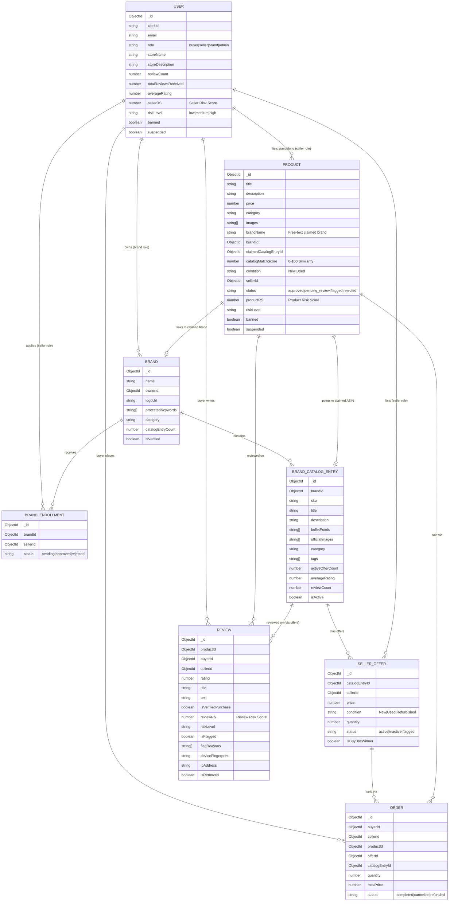

# AI-Powered Trust & Safety Platform: System Context & Architecture Summary

This document provides a comprehensive summary of the foundational architecture, database schemas, role authority models, and marketplace logic established during **Phases 1 through 3**. It serves as the core context document before implementing the AI and Machine Learning fraud detection layers.

---

## 🎯 Platform Objective

The **AI-Powered Trust & Safety Platform** is a simulated, high-fidelity e-commerce marketplace (inspired by Amazon's 3P seller and ASIN catalog model). Rather than building a generic store, the platform is designed specifically as a **fraud detection sandbox**. It contains:
1. **Honeypot Vectors:** Design surfaces that allow bad actors to attempt common fraud vectors (e.g., listing counterfeits, publishing fake review clusters, initiating coordinated pricing manipulations).
2. **AI Hook Fields:** Dedicated schema fields, metadata variables, and denormalized telemetry hooks built directly into the database to serve as inputs for future machine learning and graph algorithms.

---

## 🔑 Role Authority Matrix

The system supports five distinct user roles (`pending`, `buyer`, `seller`, `brand`, `admin`) mapped via a strict RBAC hierarchy:

| Capability | Buyer | Seller | Brand Owner | Admin |
| :--- | :---: | :---: | :---: | :---: |
| Browse & Search Catalog / Products | ✅ | ✅ | ✅ | ✅ |
| View Product Detail / Catalog Pages | ✅ | ✅ | ✅ | ✅ |
| Place Orders (Simulated Checkout) | ✅ | ❌ | ❌ | ❌ |
| Write Reviews (on purchased/viewed items) | ✅ | ❌ | ❌ | ❌ |
| Create Standalone Listings (Free-Text Brand Name) | ❌ | ✅ | ❌ | ❌ |
| List Offers against Registered Catalog Entries (ASINs) | ❌ | ✅ | ❌ | ❌ |
| Register Brand Profile & Define Keywords / Logos | ❌ | ❌ | ✅ | ❌ |
| Register Brand Catalog Entries (Official ASINs) | ❌ | ❌ | ✅ | ❌ |
| Approve / Reject Seller Brand Enrollment Requests | ❌ | ❌ | ✅ | ❌ |
| View Enrolled Sellers' Trust Scores & Analysis | ❌ | ❌ | ✅ | ❌ |
| Moderate ALL Products, Reviews, and Sellers Platform-Wide | ❌ | ❌ | ❌ | ✅ |
| Access Flagged Items Feed & Central Analytics | ❌ | ❌ | ❌ | ✅ |

### Key Architectural Boundaries:
- **Brand vs. Admin Visibility:** Brand Owners can view risk scores, reviews, and catalog match data *only* for the sellers enrolled under their brand. Admins have complete visibility and moderation control over all products, offers, reviews, and users platform-wide.
- **Reviews & Purchases:** Only `buyer` accounts can purchase products and write reviews. The system automatically computes the `isVerifiedPurchase` flag based on order history.
- **Sellers:** Can monitor their own trust scores (`sellerRS`) and listing statuses, but have zero visibility into competitor risk scores or telemetry.

---

## 📊 Database Schemas & Data Relationships

All models are built using Mongoose. The database structure has been redesigned to decouple **official catalog content** (managed by brands) from **seller-specific offers** (managed by sellers) while retaining a **standalone product model** as a counterfeit honeypot.

### Model Index Files (Schema Implementation)
1. **User Model:** [user.model.js](file:///c:/Dev/AI%20Powered%20Marketpllace%20Security/backend/src/modules/users/user.model.js)
   - Tracks authentication and core profile details. Contains denormalized rating and review statistics (`reviewCount`, `totalReviewsReceived`, `averageRating`) updated dynamically via pre-save middleware hooks to limit database joins during high-traffic queries.
2. **Product Model (Standalone / Counterfeit Honeypot):** [product.model.js](file:///c:/Dev/AI%20Powered%20Marketpllace%20Security/backend/src/modules/products/product.model.js)
   - Allows sellers to type in any brand name freely (`brandName`). This provides a vector for bad actors to claim unauthorized brands (e.g., claiming a listing is "Nike"), which triggers AI cross-reference comparison logic.
3. **Brand Model:** [brand.model.js](file:///c:/Dev/AI%20Powered%20Marketpllace%20Security/backend/src/modules/brands/brand.model.js)
   - Defines a registered brand. Contains `protectedKeywords` used by the AI firewall to detect typosquatting or brand spoofing.
4. **Brand Enrollment Model:** [brandEnrollment.model.js](file:///c:/Dev/AI%20Powered%20Marketpllace%20Security/backend/src/modules/brands/brandEnrollment.model.js)
   - Represents the approval status of a seller applying to list under a brand. Compound unique index `{ brandId, sellerId }` ensures single application bounds.
5. **Brand Catalog Entry Model (ASIN Catalog):** [brandCatalogEntry.model.js](file:///c:/Dev/AI%20Powered%20Marketpllace%20Security/backend/src/modules/brandCatalog/brandCatalogEntry.model.js)
   - Represents the authoritative specification of a brand's authentic product. Houses official content (`officialImages`, `description`, `bulletPoints`) serving as the ML ground truth fingerprint.
6. **Seller Offer Model (Multi-Seller Model):** [sellerOffer.model.js](file:///c:/Dev/AI%20Powered%20Marketpllace%20Security/backend/src/modules/offers/sellerOffer.model.js)
   - Links sellers to official catalog entries. Enforces single offer limits via unique compound index `{ catalogEntryId, sellerId }`. Supports real-time Buy Box recalculation (`isBuyBoxWinner` updates on every offer change).
7. **Order Model:** [order.model.js](file:///c:/Dev/AI%20Powered%20Marketpllace%20Security/backend/src/modules/orders/order.model.js)
   - Tracks simulated checkout transactions. Supports two paths: the **Catalog Path** (buys an offer on a catalog entry) and the **Standalone Path** (buys a standalone product). Used to compute sales velocity metrics.
8. **Review Model:** [review.model.js](file:///c:/Dev/AI%20Powered%20Marketpllace%20Security/backend/src/modules/reviews/review.model.js)
   - Tracks buyer ratings and reviews. Enforces review uniqueness per user per product via compound index `{ productId, buyerId }`. Stores crucial network features like `ipAddress` and `deviceFingerprint`.

---

## 🖥️ Frontend Architecture & Marketplace Flow

The frontend is built on **React (Vite)** with **TailwindCSS** and **shadcn/ui**, structured into clean pages and services. It simulates an Amazon-inspired design with a dark header navigation bar, search inputs, and modular dashboards.

The core page layout configurations are declared in [App.jsx](file:///c:/Dev/AI%20Powered%20Marketpllace%20Security/frontend/src/App.jsx).

### Key Workflows and Pages
1. **Public Marketplace Experience:**
   - **Home Page ([HomePage.jsx](file:///c:/Dev/AI%20Powered%20Marketpllace%20Security/frontend/src/pages/HomePage.jsx)):** Interactive category tiles, featured product grids, and search inputs.
   - **Search Results ([SearchResultsPage.jsx](file:///c:/Dev/AI%20Powered%20Marketpllace%20Security/frontend/src/pages/SearchResultsPage.jsx)):** Filters items dynamically by category, rating thresholds, and price range, pulling data directly from API query filters.
   - **ASIN Detail Page ([CatalogEntryDetailPage.jsx](file:///c:/Dev/AI%20Powered%20Marketpllace%20Security/frontend/src/pages/CatalogEntryDetailPage.jsx)):** Displays authoritative brand assets (description, bullet points, official images). Compiles all competing seller offers in a responsive listing format, highlighting the **Buy Box Winner** (cheapest seller) for one-click checkout.
   - **Standalone Product Page ([ProductDetailPage.jsx](file:///c:/Dev/AI%20Powered%20Marketpllace%20Security/frontend/src/pages/ProductDetailPage.jsx)):** Showcases the listing details customized by the individual seller. Surfaces warning flags if the seller's product triggers low similarity indices against the claimed brand catalog.
2. **Dashboards:**
   - **Seller Central ([SellerDashboard.jsx](file:///c:/Dev/AI%20Powered%20Marketpllace%20Security/frontend/src/pages/SellerDashboard.jsx)):** Allows sellers to track listings, manage current offers, apply for brand authorizations, and monitor their risk scores.
   - **Brand Registry ([BrandDashboard.jsx](file:///c:/Dev/AI%20Powered%20Marketpllace%20Security/frontend/src/pages/brand/BrandDashboard.jsx)):** Provides brand owners control over enrollment requests, allowing them to review seller risk scores, catalog match metrics, and manage their product specifications (`BrandCatalogEntry`).
   - **Admin Command Center ([AdminDashboard.jsx](file:///c:/Dev/AI%20Powered%20Marketpllace%20Security/frontend/src/pages/admin/AdminDashboard.jsx)):** Comprehensive moderation panel for reviewing flagged listings, user suspensions, and manual review overrides.

---

## 🧠 AI/ML Fraud Detection Integration Hooks

Every model has been built with distinct telemetry attributes to feed directly into the upcoming AI/ML pipelines:

### 1. NLP Fake Review Detection (DistilBERT / RoBERTa)
- **Input Hooks:** `Review.text`, `Review.rating`, `Review.isVerifiedPurchase`.
- **Target:** Mass-generated synthetic 5-star reviews or coordinated 1-star competitor sabotage campaigns.
- **Pipeline Integration:** Reviews are sent to a text-analysis pipeline to check for structural repetition, template similarity, and semantic sentiment mismatches (e.g., highly negative text with a 5-star rating).

### 2. Review Ring Graph Analysis (NetworkX / Graph Neural Networks)
- **Input Hooks:** `Review.buyerId`, `Review.sellerId`, `Review.productId`, `Review.ipAddress`, `Review.deviceFingerprint`, `Review.createdAt`.
- **Target:** Coordinated review groups ("brushing networks") where buyers are compensated to review specific seller circles using shared networks or devices.
- **Pipeline Integration:** NetworkX maps reviewer-to-seller connections. High clustering coefficients, shared IP nodes, and temporal review bursts flag coordinated accounts.

### 3. Counterfeit Detection (MLLM & Computer Vision)
- **Input Hooks:** `Product.images` vs. `BrandCatalogEntry.officialImages`, `Product.description` vs. `BrandCatalogEntry.description`.
- **Target:** Unauthorized resellers listing knockoffs on cloned pages.
- **Pipeline Integration:**
  - **SBERT (Semantic BERT):** Measures cosine similarity of textual descriptions against official brand descriptions.
  - **Computer Vision (logo & perceptual hashes):** Analyzes seller product images against official brand images to detect logo anomalies and stolen catalog photos.

### 4. Typosquatting and Brand Hijacking (Named Entity Recognition)
- **Input Hooks:** `Product.brandName` vs. `Brand.name`, `Brand.protectedKeywords`.
- **Target:** Fraudulent listings tricking buyers by slightly misspelling protected brands (e.g., "Nkie" or "Adidass").
- **Pipeline Integration:** Real-time NER extracts claimed brand strings upon listing creation, matching them against protected keywords of registered brands.

### 5. Anomaly Detection (Isolation Forest & Sales Velocity)
- **Input Hooks:** `SellerOffer.price` vs. historical averages, `Product.salesVelocity`, `Order.createdAt`.
- **Target:** "Bait-and-Switch" scams where a seller takes over the Buy Box with an extremely low price, collects order revenue rapidly, and deletes the listing.
- **Pipeline Integration:** Anomaly detection models evaluate pricing deviations and sales volume velocity. Extreme spikes trigger temporary listing freezes.

---

## 🛠️ Developer Simulation Toolkit

To facilitate stress-testing of the AI pipelines, the platform contains seed scripts and developer utilities:
- **Seed Script ([seed.js](file:///c:/Dev/AI%20Powered%20Marketpllace%20Security/backend/seed.js)):** Automatically builds out mock users, registered brands, official catalog entries, competing offers, mock orders, and reviews.
- **DevTools Component ([DevTools.jsx](file:///c:/Dev/AI%20Powered%20Marketpllace%20Security/frontend/src/components/shared/DevTools.jsx)):** A frontend overlay that lets developers toggle simulated fraud scenarios (e.g., triggering a fake review burst, introducing pricing drops) to verify that risk telemetry propagates correctly across user dashboards.
